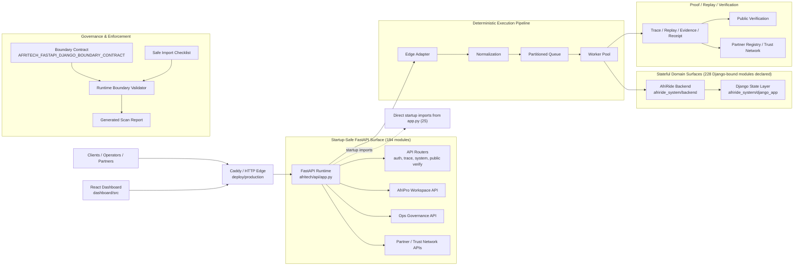
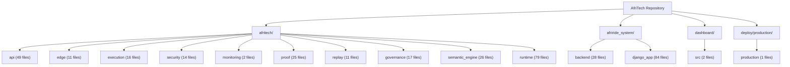

# AfriTech Full Architecture Graph

Status: GENERATED FULL ARCHITECTURE GRAPH

Classification: REPO-BACKED ARCHITECTURE INVENTORY AND RUNTIME GRAPH

Purpose: render a current-state architecture graph from the repository,
the FastAPI startup closure, and the runtime boundary validator output.

Generated: `deterministic-repo-snapshot`

## Runtime Summary

- Startup module: `afritech.api.app`
- Startup-safe closure size: `184`
- Django-bound modules declared in repo: `228`
- Runtime-boundary violations: `0`
- Direct startup imports from `afritech.api.app`: `25`

## Runtime Architecture Graph

## Repository Architecture Inventory

## Repo Area Counts

- `api`: `49` files
- `edge`: `11` files
- `execution`: `16` files
- `security`: `14` files
- `monitoring`: `2` files
- `proof`: `25` files
- `replay`: `11` files
- `governance`: `17` files
- `semantic_engine`: `26` files
- `runtime`: `79` files
- `afriride_backend`: `28` files
- `afriride_django`: `84` files
- `dashboard_ui`: `2` files
- `deploy_production`: `1` files

## Startup Inventory

### Api (21)

- `afritech.api.afroprog_workspace_api`
- `afritech.api.app`
- `afritech.api.architecture_proof_api`
- `afritech.api.auth`
- `afritech.api.auth.jwt_device_auth`
- `afritech.api.auth.legacy_auth`
- `afritech.api.contracts`
- `afritech.api.contracts.rules`
- `afritech.api.contracts.validator`
- `afritech.api.dashboard_gateway_api`
- `afritech.api.ingestion`
- `afritech.api.ingestion.event_ingestion`
- `afritech.api.ops_governance_api`
- `afritech.api.partner_registry_api`
- `afritech.api.partner_verification_api`
- `afritech.api.public_verification_api`
- `afritech.api.realtime`
- `afritech.api.realtime.ws_server`
- `afritech.api.system_status`
- `afritech.api.trace_api`
- `afritech.api.trust_network_api`

### Edge (11)

- `afritech.edge`
- `afritech.edge.adapter`
- `afritech.edge.adapter.runtime_adapter`
- `afritech.edge.adapter.validation`
- `afritech.edge.ingestion`
- `afritech.edge.ingestion.queue_ingestor`
- `afritech.edge.ingestion.reality_ingestor`
- `afritech.edge.normalization`
- `afritech.edge.normalization.normalizer`
- `afritech.edge.normalization.reality_events`
- `afritech.edge.normalization.validation`

### Execution (7)

- `afritech.execution.partition`
- `afritech.execution.partition.router`
- `afritech.execution.queue`
- `afritech.execution.queue.partitioned_queue`
- `afritech.execution.worker`
- `afritech.execution.worker.types`
- `afritech.execution.worker.worker_pool`

### Monitoring (2)

- `afritech.monitoring.alerts`
- `afritech.monitoring.realtime_anomaly_alerting`

### Other (127)

- `afritech`
- `afritech.afriprogramming`
- `afritech.afriprogramming.constants`
- `afritech.afriprogramming.integration`
- `afritech.afriprogramming.models`
- `afritech.afriprogramming.proposals`
- `afritech.afriprogramming.services`
- `afritech.afriprogramming.tooling_manifest`
- `afritech.afriprogramming.tooling_surfaces`
- `afritech.afroprog_workspace`
- `afritech.afroprog_workspace.models`
- `afritech.afroprog_workspace.service`
- `afritech.afroprog_workspace.workspace`
- `afritech.architecture.afritech_dashboard`
- `afritech.architecture.afritech_dashboard.services`
- `afritech.architecture.afritech_dashboard.views`
- `afritech.architecture.blockchain_anchor`
- `afritech.architecture.config_loader`
- `afritech.architecture.full_architecture_graph`
- `afritech.architecture.integrity_proof`
- `afritech.ci`
- `afritech.ci.runtime_boundary_validator`
- `afritech.core`
- `afritech.core.engine`
- `afritech.core.matching_engine`
- `afritech.core.runtime`
- `afritech.core.runtime.worker`
- `afritech.core.runtime.worker.worker`
- `afritech.crypto.anchor_publication`
- `afritech.crypto.external_anchor`
- `afritech.crypto.multi_party_verification`
- `afritech.crypto.public_chain_anchor`
- `afritech.extensions.afriprog`
- `afritech.extensions.afriprog.ai_engine`
- `afritech.extensions.afriprog.ai_engine.coder`
- `afritech.extensions.afriprog.ai_engine.design_generator`
- `afritech.extensions.afriprog.ai_engine.design_output_validator`
- `afritech.extensions.afriprog.ai_engine.objective_engine`
- `afritech.extensions.afriprog.ai_engine.planner`
- `afritech.extensions.afriprog.ai_engine.reviewer`
- `afritech.extensions.afriprog.ai_engine.task_generator`
- `afritech.extensions.afriprog.ai_engine.test_writer`
- `afritech.extensions.afriprog.code_executor`
- `afritech.extensions.afriprog.code_executor.ast_editor`
- `afritech.extensions.afriprog.code_executor.diff_model`
- `afritech.extensions.afriprog.code_executor.executor_preview`
- `afritech.extensions.afriprog.code_executor.patch_generator`
- `afritech.extensions.afriprog.code_executor.patch_model`
- `afritech.extensions.afriprog.code_executor.sandbox`
- `afritech.extensions.afriprog.command_center`
- `afritech.extensions.afriprog.command_center.execution_engine`
- `afritech.extensions.afriprog.command_center.task_dispatcher`
- `afritech.extensions.afriprog.command_center.worktree_manager`
- `afritech.extensions.afriprog.constitutional_guard.authority_guard`
- `afritech.extensions.afriprog.constitutional_guard.claim_guard`
- `afritech.extensions.afriprog.constitutional_guard.guard_orchestrator`
- `afritech.extensions.afriprog.constitutional_guard.replay_guard`
- `afritech.extensions.afriprog.constitutional_guard.surface_guard`
- `afritech.extensions.afriprog.contracts`
- `afritech.extensions.afriprog.contracts.engineering_receipt`
- `afritech.extensions.afriprog.contracts.engineering_task`
- `afritech.extensions.afriprog.contracts.evidence_record`
- `afritech.extensions.afriprog.copilot_assist`
- `afritech.extensions.afriprog.copilot_assist.context_collector`
- `afritech.extensions.afriprog.copilot_assist.explanation_builder`
- `afritech.extensions.afriprog.copilot_assist.proposal_intelligence`
- `afritech.extensions.afriprog.copilot_assist.safety_classifier`
- `afritech.extensions.afriprog.copilot_assist.suggestion_engine`
- `afritech.extensions.afriprog.copilot_assist.suggestion_model`
- `afritech.extensions.afriprog.copilot_assist.validation_gate`
- `afritech.extensions.afriprog.design_generator`
- `afritech.extensions.afriprog.design_generator.architecture`
- `afritech.extensions.afriprog.design_generator.architecture.architecture_generator`
- `afritech.extensions.afriprog.design_generator.architecture.dependency_mapper`
- `afritech.extensions.afriprog.design_generator.architecture.module_generator`
- `afritech.extensions.afriprog.design_generator.contracts`
- `afritech.extensions.afriprog.design_generator.contracts.api_contract_generator`
- `afritech.extensions.afriprog.design_generator.contracts.database_contract_generator`
- `afritech.extensions.afriprog.design_generator.contracts.event_contract_generator`
- `afritech.extensions.afriprog.design_generator.design_orchestrator`
- `afritech.extensions.afriprog.design_generator.design_reviewer`
- `afritech.extensions.afriprog.design_generator.evidence`
- `afritech.extensions.afriprog.design_generator.evidence.design_evidence_generator`
- `afritech.extensions.afriprog.design_generator.planning`
- `afritech.extensions.afriprog.design_generator.planning.implementation_plan_generator`
- `afritech.extensions.afriprog.design_generator.planning.milestone_generator`
- `afritech.extensions.afriprog.design_generator.requirements`
- `afritech.extensions.afriprog.design_generator.requirements.domain_analyzer`
- `afritech.extensions.afriprog.design_generator.requirements.requirements_extractor`
- `afritech.extensions.afriprog.evidence`
- `afritech.extensions.afriprog.evidence.evidence_generator`
- `afritech.extensions.afriprog.evidence.evidence_model`
- `afritech.extensions.afriprog.execution`
- `afritech.extensions.afriprog.execution.loop_engine`
- `afritech.extensions.afriprog.monitoring`
- `afritech.extensions.afriprog.monitoring.lifecycle_monitor`
- `afritech.extensions.afriprog.orchestrator`
- `afritech.extensions.afriprog.repository_intelligence`
- `afritech.extensions.afriprog.repository_intelligence.contract_locator`
- `afritech.extensions.afriprog.repository_intelligence.orchestrator_preview`
- `afritech.extensions.afriprog.repository_intelligence.repo_loader`
- `afritech.extensions.afriprog.repository_intelligence.report_builder`
- `afritech.extensions.afriprog.repository_intelligence.structure_mapper`
- `afritech.extensions.afriprog.repository_intelligence.surface_locator`
- `afritech.extensions.afriprog.repository_intelligence.test_mapper`
- `afritech.extensions.afriprog.task_planner`
- `afritech.extensions.afriprog.task_planner.failure_parser`
- `afritech.extensions.afriprog.task_planner.planner`
- `afritech.extensions.afriprog.task_planner.task_model`
- `afritech.extensions.afriprog.task_planner.task_types`
- `afritech.extensions.afriprog.validator_runner`
- `afritech.extensions.afriprog.validator_runner.command_result`
- `afritech.guards`
- `afritech.guards.edge_input_guard`
- `afritech.ops_dashboard`
- `afritech.runtime_monitoring`
- `afritech.runtime_monitoring.anomaly_classifier`
- `afritech.runtime_monitoring.anomaly_context_builder`
- `afritech.runtime_monitoring.anomaly_detector`
- `afritech.runtime_monitoring.anomaly_to_proposal`
- `afritech.runtime_monitoring.monitor`
- `afritech.runtime_monitoring.monitoring_validators`
- `afritech.simulation`
- `afritech.simulation.validation_receipt`
- `afritech.storage`
- `afritech.storage.event_log`
- `afritech.storage.event_schema`

### Security (12)

- `afritech.security`
- `afritech.security.adversarial_engine`
- `afritech.security.ai_anomaly_engine`
- `afritech.security.anomaly`
- `afritech.security.anomaly_ml`
- `afritech.security.device_identity`
- `afritech.security.ed25519`
- `afritech.security.event_authenticator`
- `afritech.security.integrity_trace`
- `afritech.security.ip_control`
- `afritech.security.mutation_guard`
- `afritech.security.rate_limit`

### Trust And Registry (4)

- `afritech.partner_registry`
- `afritech.partner_verification`
- `afritech.standards_dependency`
- `afritech.trust_network`

## Direct Startup Imports

- `afritech.api.afroprog_workspace_api`
- `afritech.api.architecture_proof_api`
- `afritech.api.auth.jwt_device_auth`
- `afritech.api.dashboard_gateway_api`
- `afritech.api.ingestion.event_ingestion`
- `afritech.api.ops_governance_api`
- `afritech.api.partner_registry_api`
- `afritech.api.partner_verification_api`
- `afritech.api.public_verification_api`
- `afritech.api.realtime.ws_server`
- `afritech.api.system_status`
- `afritech.api.trace_api`
- `afritech.api.trust_network_api`
- `afritech.edge.adapter.runtime_adapter`
- `afritech.edge.adapter.validation`
- `afritech.edge.ingestion.queue_ingestor`
- `afritech.edge.normalization.normalizer`
- `afritech.edge.normalization.validation`
- `afritech.execution.partition.router`
- `afritech.execution.queue.partitioned_queue`
- `afritech.execution.worker.worker_pool`
- `afritech.partner_registry`
- `afritech.partner_verification`
- `afritech.standards_dependency`
- `afritech.trust_network`

## Interpretation

- The runtime graph is based on the current production-style FastAPI entrypoint.
- The inventory graph is repo-wide and broader than the active startup path.
- Django-bound surfaces are allowed in the repo but must remain outside FastAPI import-time coupling.
- Regenerate this file after major routing, deployment, or domain-boundary changes.

