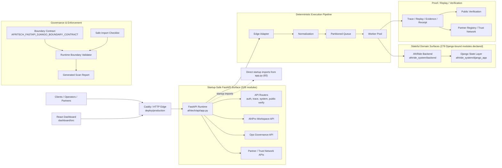
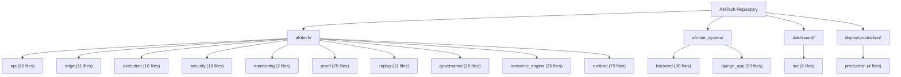

# AfriTech Full Architecture Graph

Status: GENERATED FULL ARCHITECTURE GRAPH

Classification: REPO-BACKED ARCHITECTURE INVENTORY AND RUNTIME GRAPH

Purpose: render a current-state architecture graph from the repository,
the FastAPI startup closure, and the runtime boundary validator output.

Generated: `deterministic-repo-snapshot`

## Runtime Summary

- Startup module: `afritech.api.app`
- Startup-safe closure size: `528`
- Django-bound modules declared in repo: `279`
- Runtime-boundary violations: `0`
- Direct startup imports from `afritech.api.app`: `65`

## Runtime Architecture Graph

```mermaid
flowchart LR
    Client["Clients / Operators / Partners"] --> Edge["Caddy / HTTP Edge\ndeploy/production"]
    Dashboard["React Dashboard\ndashboard/src"] --> Edge
    Edge --> App["FastAPI Runtime\nafritech/api/app.py"]

    subgraph FastAPI["Startup-Safe FastAPI Surface (528 modules)"]
        App --> Api["API Routers\nauth, trace, system, public verify"]
        App --> Workspace["AfriPro Workspace API"]
        App --> Governance["Ops Governance API"]
        App --> Trust["Partner / Trust Network APIs"]
    end

    subgraph Pipeline["Deterministic Execution Pipeline"]
        App --> Adapt["Edge Adapter"]
        Adapt --> Normalize["Normalization"]
        Normalize --> Queue["Partitioned Queue"]
        Queue --> Worker["Worker Pool"]
    end

    subgraph State["Stateful Domain Surfaces (279 Django-bound modules declared)"]
        Worker --> Domain["AfriRide Backend\nafriride_system/backend"]
        Domain --> Django["Django State Layer\nafriride_system/django_app"]
    end

    subgraph Proof["Proof / Replay / Verification"]
        Worker --> Trace["Trace / Replay / Evidence / Receipt"]
        Trace --> Public["Public Verification"]
        Trace --> Registry["Partner Registry / Trust Network"]
    end

    subgraph GovernancePlane["Governance & Enforcement"]
        Contract["Boundary Contract\nAFRITECH_FASTAPI_DJANGO_BOUNDARY_CONTRACT"] --> Validator["Runtime Boundary Validator"]
        Checklist["Safe Import Checklist"] --> Validator
        Validator --> Review["Generated Scan Report"]
    end

    App -. startup imports .-> Imports["Direct startup imports from app.py (65)"]
```

## Repository Architecture Inventory

```mermaid
flowchart TD
    Root["AfriTech Repository"] --> Core["afritech/"]
    Root --> Ride["afriride_system/"]
    Root --> Ui["dashboard/"]
    Root --> Deploy["deploy/production/"]

    Core --> Api["api (85 files)"]
    Core --> Edge["edge (11 files)"]
    Core --> Execution["execution (16 files)"]
    Core --> Security["security (18 files)"]
    Core --> Monitoring["monitoring (2 files)"]
    Core --> Proof["proof (25 files)"]
    Core --> Replay["replay (11 files)"]
    Core --> Governance["governance (18 files)"]
    Core --> Semantic["semantic_engine (26 files)"]
    Core --> Runtime["runtime (79 files)"]

    Ride --> Backend["backend (30 files)"]
    Ride --> Django["django_app (99 files)"]
    Ui --> Dashboard["src (6 files)"]
    Deploy --> Production["production (4 files)"]
```

## Repo Area Counts

- `api`: `85` files
- `edge`: `11` files
- `execution`: `16` files
- `security`: `18` files
- `monitoring`: `2` files
- `proof`: `25` files
- `replay`: `11` files
- `governance`: `18` files
- `semantic_engine`: `26` files
- `runtime`: `79` files
- `afriride_backend`: `30` files
- `afriride_django`: `99` files
- `dashboard_ui`: `6` files
- `deploy_production`: `4` files

## Startup Inventory

### Api (55)

- `afritech.api.afriprogramming_control_api`
- `afritech.api.afriride_mobile_release_api`
- `afritech.api.afriride_next_gen_mobile_api`
- `afritech.api.afriride_operational_api`
- `afritech.api.afroprog_workspace_api`
- `afritech.api.app`
- `afritech.api.architecture_proof_api`
- `afritech.api.auth`
- `afritech.api.auth.jwt_device_auth`
- `afritech.api.auth.legacy_auth`
- `afritech.api.contracts`
- `afritech.api.contracts.rules`
- `afritech.api.contracts.schema_registry_api`
- `afritech.api.contracts.schema_registry_middleware`
- `afritech.api.contracts.validator`
- `afritech.api.core_platform_api`
- `afritech.api.dashboard_gateway_api`
- `afritech.api.documentation_compliance_api`
- `afritech.api.feature_registry_api`
- `afritech.api.ingestion`
- `afritech.api.ingestion.event_ingestion`
- `afritech.api.mobile_intelligence_api`
- `afritech.api.novaid_api`
- `afritech.api.novapay_ecosystem_api`
- `afritech.api.novapay_runtime_api`
- `afritech.api.novaportal_suite_api`
- `afritech.api.novascript_api`
- `afritech.api.novatech_intranet_api`
- `afritech.api.ops_governance_api`
- `afritech.api.partner_certification_api`
- `afritech.api.partner_governance_api`
- `afritech.api.partner_registry_api`
- `afritech.api.partner_verification_api`
- `afritech.api.phase0_api`
- `afritech.api.phase10_api`
- `afritech.api.phase11_api`
- `afritech.api.phase12_api`
- `afritech.api.phase13_api`
- `afritech.api.phase1_api`
- `afritech.api.phase2_api`
- `afritech.api.phase3_api`
- `afritech.api.phase4_api`
- `afritech.api.phase5_api`
- `afritech.api.phase6_api`
- `afritech.api.phase7_api`
- `afritech.api.phase8_api`
- `afritech.api.phase9_api`
- `afritech.api.public_verification_api`
- `afritech.api.realtime`
- `afritech.api.realtime.dashboard_bus`
- `afritech.api.realtime.ride_bus`
- `afritech.api.realtime.ws_server`
- `afritech.api.system_status`
- `afritech.api.trace_api`
- `afritech.api.trust_network_api`

### Edge (11)

- `afritech.edge`
- `afritech.edge.adapter`
- `afritech.edge.adapter.runtime_adapter`
- `afritech.edge.adapter.validation`
- `afritech.edge.ingestion`
- `afritech.edge.ingestion.queue_ingestor`
- `afritech.edge.ingestion.reality_ingestor`
- `afritech.edge.normalization`
- `afritech.edge.normalization.normalizer`
- `afritech.edge.normalization.reality_events`
- `afritech.edge.normalization.validation`

### Execution (7)

- `afritech.execution.partition`
- `afritech.execution.partition.router`
- `afritech.execution.queue`
- `afritech.execution.queue.partitioned_queue`
- `afritech.execution.worker`
- `afritech.execution.worker.types`
- `afritech.execution.worker.worker_pool`

### Monitoring (2)

- `afritech.monitoring.alerts`
- `afritech.monitoring.realtime_anomaly_alerting`

### Other (433)

- `afritech`
- `afritech.afripay`
- `afritech.afripay.api`
- `afritech.afripay.audit_sandbox`
- `afritech.afripay.billing`
- `afritech.afripay.certification_fraud`
- `afritech.afripay.compliance`
- `afritech.afripay.config`
- `afritech.afripay.dao_economy`
- `afritech.afripay.events`
- `afritech.afripay.exceptions`
- `afritech.afripay.external_packages`
- `afritech.afripay.fx`
- `afritech.afripay.global_treasury_ai`
- `afritech.afripay.guards`
- `afritech.afripay.intelligence`
- `afritech.afripay.ledger`
- `afritech.afripay.models`
- `afritech.afripay.money`
- `afritech.afripay.observability`
- `afritech.afripay.orchestration`
- `afritech.afripay.proofs`
- `afritech.afripay.protocol`
- `afritech.afripay.providers`
- `afritech.afripay.public_validation`
- `afritech.afripay.reconciliation`
- `afritech.afripay.routing`
- `afritech.afripay.treasury`
- `afritech.afripay.treasury_ai`
- `afritech.afriprogramming`
- `afritech.afriprogramming.assurance`
- `afritech.afriprogramming.assurance.assurance_engine`
- `afritech.afriprogramming.assurance.cert_signer`
- `afritech.afriprogramming.assurance.certification`
- `afritech.afriprogramming.assurance.continuous_engine`
- `afritech.afriprogramming.assurance.crypto_hardening`
- `afritech.afriprogramming.assurance.distributed_network`
- `afritech.afriprogramming.assurance.event_streaming`
- `afritech.afriprogramming.assurance.pki`
- `afritech.afriprogramming.assurance.policy_registry`
- `afritech.afriprogramming.assurance.replay_registry`
- `afritech.afriprogramming.assurance.reports`
- `afritech.afriprogramming.assurance.retention`
- `afritech.afriprogramming.assurance.risk_engine`
- `afritech.afriprogramming.assurance.risk_prediction`
- `afritech.afriprogramming.assurance.signed_audit`
- `afritech.afriprogramming.assurance.trust_engine`
- `afritech.afriprogramming.assurance.trust_exchange`
- `afritech.afriprogramming.assurance.trust_fabric`
- `afritech.afriprogramming.assurance.trust_trends`
- `afritech.afriprogramming.assurance.workflows`
- `afritech.afriprogramming.assurance.zero_trust`
- `afritech.afriprogramming.constants`
- `afritech.afriprogramming.control_plane`
- `afritech.afriprogramming.integration`
- `afritech.afriprogramming.models`
- `afritech.afriprogramming.persistence`
- `afritech.afriprogramming.phase1`
- `afritech.afriprogramming.phase10`
- `afritech.afriprogramming.phase11`
- `afritech.afriprogramming.phase12`
- `afritech.afriprogramming.phase13`
- `afritech.afriprogramming.phase2`
- `afritech.afriprogramming.phase3`
- `afritech.afriprogramming.phase4`
- `afritech.afriprogramming.phase5`
- `afritech.afriprogramming.phase6`
- `afritech.afriprogramming.phase7`
- `afritech.afriprogramming.phase8`
- `afritech.afriprogramming.phase9`
- `afritech.afriprogramming.phase_common`
- `afritech.afriprogramming.proposals`
- `afritech.afriprogramming.rbac`
- `afritech.afriprogramming.roles`
- `afritech.afriprogramming.schemas`
- `afritech.afriprogramming.services`
- `afritech.afriprogramming.tooling_manifest`
- `afritech.afriprogramming.tooling_surfaces`
- `afritech.afriprogramming.v9`
- `afritech.afriprogramming.v9.crypto_governance`
- `afritech.afriprogramming.v9.scheduler`
- `afritech.afriprogramming.v9.schema`
- `afritech.afriprogramming.v9.tracing`
- `afritech.afriprogramming.v9.trust_consensus`
- `afritech.afriride_mobile_release`
- `afritech.afroprog_workspace`
- `afritech.afroprog_workspace.models`
- `afritech.afroprog_workspace.service`
- `afritech.afroprog_workspace.workspace`
- `afritech.architecture.afritech_dashboard`
- `afritech.architecture.afritech_dashboard.services`
- `afritech.architecture.afritech_dashboard.views`
- `afritech.architecture.anchor_indexer`
- `afritech.architecture.blockchain_anchor`
- `afritech.architecture.config_loader`
- `afritech.architecture.full_architecture_graph`
- `afritech.architecture.integrity_proof`
- `afritech.architecture.novaride_app_store`
- `afritech.architecture.novaride_architecture`
- `afritech.architecture.novaride_protocol_marketplace`
- `afritech.architecture.novaride_super_app`
- `afritech.audit.merkle`
- `afritech.chain`
- `afritech.chain.anchor_publisher`
- `afritech.chain.contracts`
- `afritech.chain.contracts.architecture_anchor_abi`
- `afritech.chain.contracts.architecture_anchor_v2_abi`
- `afritech.chain.contracts.contract_client`
- `afritech.chain.contracts.deployment_config`
- `afritech.chain.sepolia_client`
- `afritech.chain.types`
- `afritech.ci`
- `afritech.ci.runtime_boundary_validator`
- `afritech.compliance.continuous_assurance`
- `afritech.contracts.guards_interface`
- `afritech.core`
- `afritech.core.engine`
- `afritech.core.matching_engine`
- `afritech.core.runtime`
- `afritech.core.runtime.receipts`
- `afritech.core.runtime.system_enforcement.execution_guard`
- `afritech.core.runtime.worker`
- `afritech.core.runtime.worker.worker`
- `afritech.core_platform`
- `afritech.core_platform.adaptive_sla`
- `afritech.core_platform.anchoring`
- `afritech.core_platform.audit_export`
- `afritech.core_platform.auditor_dashboard`
- `afritech.core_platform.autonomous_control`
- `afritech.core_platform.autonomous_ecosystem`
- `afritech.core_platform.canonical`
- `afritech.core_platform.cbdc`
- `afritech.core_platform.compliance_report`
- `afritech.core_platform.consensus`
- `afritech.core_platform.cross_chain_light_client`
- `afritech.core_platform.cryptographic_consensus`
- `afritech.core_platform.distributed_verification`
- `afritech.core_platform.event_bus`
- `afritech.core_platform.export_bundle`
- `afritech.core_platform.geo_routing`
- `afritech.core_platform.hash_domains`
- `afritech.core_platform.live_transaction`
- `afritech.core_platform.migration_system`
- `afritech.core_platform.mobile_verifier`
- `afritech.core_platform.models`
- `afritech.core_platform.novapay_runtime`
- `afritech.core_platform.onchain_light_verifier`
- `afritech.core_platform.orm`
- `afritech.core_platform.payments`
- `afritech.core_platform.payments.contracts`
- `afritech.core_platform.payments.mobile_money`
- `afritech.core_platform.payments.providers`
- `afritech.core_platform.persistence`
- `afritech.core_platform.privacy_qr`
- `afritech.core_platform.proof_receipts`
- `afritech.core_platform.qr`
- `afritech.core_platform.qr_proof`
- `afritech.core_platform.services`
- `afritech.core_platform.settlement`
- `afritech.core_platform.signing`
- `afritech.core_platform.smart_contract_verification`
- `afritech.core_platform.smart_resolver`
- `afritech.core_platform.stack`
- `afritech.core_platform.stateless_verifier`
- `afritech.core_platform.threshold_bls`
- `afritech.core_platform.transfers`
- `afritech.core_platform.trust_node`
- `afritech.core_platform.zk_receipts`
- `afritech.crypto.anchor_publication`
- `afritech.crypto.external_anchor`
- `afritech.crypto.merkle`
- `afritech.crypto.multi_party_verification`
- `afritech.crypto.public_chain_anchor`
- `afritech.crypto.signature`
- `afritech.dispatch`
- `afritech.dispatch.matching`
- `afritech.dispatch.presence`
- `afritech.dispatch.service`
- `afritech.distributed.consensus`
- `afritech.distributed.consensus.quorum`
- `afritech.distributed.node`
- `afritech.distributed.trust`
- `afritech.distributed.trust.reputation_store`
- `afritech.distributed.trust.scoring`
- `afritech.distributed.trust.slashing`
- `afritech.distributed.trust.trust_engine`
- `afritech.docs`
- `afritech.docs.document_system`
- `afritech.ecosystem_evolution`
- `afritech.epoch`
- `afritech.epoch.compiled.semantic_epoch`
- `afritech.epoch.epoch_snapshot`
- `afritech.extensions.afriprog`
- `afritech.extensions.afriprog.ai_engine`
- `afritech.extensions.afriprog.ai_engine.coder`
- `afritech.extensions.afriprog.ai_engine.design_generator`
- `afritech.extensions.afriprog.ai_engine.design_output_validator`
- `afritech.extensions.afriprog.ai_engine.objective_engine`
- `afritech.extensions.afriprog.ai_engine.planner`
- `afritech.extensions.afriprog.ai_engine.reviewer`
- `afritech.extensions.afriprog.ai_engine.task_generator`
- `afritech.extensions.afriprog.ai_engine.test_writer`
- `afritech.extensions.afriprog.code_executor`
- `afritech.extensions.afriprog.code_executor.ast_editor`
- `afritech.extensions.afriprog.code_executor.diff_model`
- `afritech.extensions.afriprog.code_executor.executor_preview`
- `afritech.extensions.afriprog.code_executor.patch_generator`
- `afritech.extensions.afriprog.code_executor.patch_model`
- `afritech.extensions.afriprog.code_executor.sandbox`
- `afritech.extensions.afriprog.command_center`
- `afritech.extensions.afriprog.command_center.execution_engine`
- `afritech.extensions.afriprog.command_center.task_dispatcher`
- `afritech.extensions.afriprog.command_center.worktree_manager`
- `afritech.extensions.afriprog.constitutional_guard.authority_guard`
- `afritech.extensions.afriprog.constitutional_guard.claim_guard`
- `afritech.extensions.afriprog.constitutional_guard.guard_orchestrator`
- `afritech.extensions.afriprog.constitutional_guard.replay_guard`
- `afritech.extensions.afriprog.constitutional_guard.surface_guard`
- `afritech.extensions.afriprog.contracts`
- `afritech.extensions.afriprog.contracts.engineering_receipt`
- `afritech.extensions.afriprog.contracts.engineering_task`
- `afritech.extensions.afriprog.contracts.evidence_record`
- `afritech.extensions.afriprog.copilot_assist`
- `afritech.extensions.afriprog.copilot_assist.context_collector`
- `afritech.extensions.afriprog.copilot_assist.explanation_builder`
- `afritech.extensions.afriprog.copilot_assist.proposal_intelligence`
- `afritech.extensions.afriprog.copilot_assist.safety_classifier`
- `afritech.extensions.afriprog.copilot_assist.suggestion_engine`
- `afritech.extensions.afriprog.copilot_assist.suggestion_model`
- `afritech.extensions.afriprog.copilot_assist.validation_gate`
- `afritech.extensions.afriprog.design_generator`
- `afritech.extensions.afriprog.design_generator.architecture`
- `afritech.extensions.afriprog.design_generator.architecture.architecture_generator`
- `afritech.extensions.afriprog.design_generator.architecture.dependency_mapper`
- `afritech.extensions.afriprog.design_generator.architecture.module_generator`
- `afritech.extensions.afriprog.design_generator.contracts`
- `afritech.extensions.afriprog.design_generator.contracts.api_contract_generator`
- `afritech.extensions.afriprog.design_generator.contracts.database_contract_generator`
- `afritech.extensions.afriprog.design_generator.contracts.event_contract_generator`
- `afritech.extensions.afriprog.design_generator.design_orchestrator`
- `afritech.extensions.afriprog.design_generator.design_reviewer`
- `afritech.extensions.afriprog.design_generator.evidence`
- `afritech.extensions.afriprog.design_generator.evidence.design_evidence_generator`
- `afritech.extensions.afriprog.design_generator.planning`
- `afritech.extensions.afriprog.design_generator.planning.implementation_plan_generator`
- `afritech.extensions.afriprog.design_generator.planning.milestone_generator`
- `afritech.extensions.afriprog.design_generator.requirements`
- `afritech.extensions.afriprog.design_generator.requirements.domain_analyzer`
- `afritech.extensions.afriprog.design_generator.requirements.requirements_extractor`
- `afritech.extensions.afriprog.evidence`
- `afritech.extensions.afriprog.evidence.evidence_generator`
- `afritech.extensions.afriprog.evidence.evidence_model`
- `afritech.extensions.afriprog.execution`
- `afritech.extensions.afriprog.execution.loop_engine`
- `afritech.extensions.afriprog.monitoring`
- `afritech.extensions.afriprog.monitoring.lifecycle_monitor`
- `afritech.extensions.afriprog.orchestrator`
- `afritech.extensions.afriprog.repository_intelligence`
- `afritech.extensions.afriprog.repository_intelligence.contract_locator`
- `afritech.extensions.afriprog.repository_intelligence.orchestrator_preview`
- `afritech.extensions.afriprog.repository_intelligence.repo_loader`
- `afritech.extensions.afriprog.repository_intelligence.report_builder`
- `afritech.extensions.afriprog.repository_intelligence.structure_mapper`
- `afritech.extensions.afriprog.repository_intelligence.surface_locator`
- `afritech.extensions.afriprog.repository_intelligence.test_mapper`
- `afritech.extensions.afriprog.task_planner`
- `afritech.extensions.afriprog.task_planner.failure_parser`
- `afritech.extensions.afriprog.task_planner.planner`
- `afritech.extensions.afriprog.task_planner.task_model`
- `afritech.extensions.afriprog.task_planner.task_types`
- `afritech.extensions.afriprog.validator_runner`
- `afritech.extensions.afriprog.validator_runner.command_result`
- `afritech.features`
- `afritech.fintech`
- `afritech.fintech.mock_provider`
- `afritech.fintech.payment_provider`
- `afritech.fintech.webhook_security`
- `afritech.fintech.webhooks`
- `afritech.global_verification`
- `afritech.governance`
- `afritech.governance.adr_anchor`
- `afritech.guards`
- `afritech.guards.edge_input_guard`
- `afritech.guards.engine`
- `afritech.identity`
- `afritech.identity.mobility_participant`
- `afritech.intelligence`
- `afritech.intelligence.mobile_projection`
- `afritech.middleware`
- `afritech.middleware.circuit_breaker`
- `afritech.middleware.distributed_governance`
- `afritech.middleware.governance_middleware`
- `afritech.middleware.multi_region_redis`
- `afritech.middleware.rate_limiter`
- `afritech.middleware.redis_circuit_breaker`
- `afritech.middleware.redis_rate_limiter`
- `afritech.mobility`
- `afritech.mobility.cross_border_federation`
- `afritech.mobility.federation`
- `afritech.mobility.federation_invariants`
- `afritech.mobility.field_evidence`
- `afritech.mobility.fleet_governance`
- `afritech.mobility.fleet_governance_invariants`
- `afritech.mobility.institutional_networks`
- `afritech.mobility.intelligence_layer`
- `afritech.mobility.legal_compliance_layer`
- `afritech.mobility.logistics_custody_chain`
- `afritech.mobility.logistics_custody_invariants`
- `afritech.mobility.market`
- `afritech.mobility.market_invariants`
- `afritech.mobility.pilot_deployment_architecture`
- `afritech.mobility.public_evidence_api`
- `afritech.mobility.real_time_execution_engine`
- `afritech.mobility.realtime_hub`
- `afritech.mobility.reconciliation`
- `afritech.mobility.regulator_certification_layer`
- `afritech.mobility.self_auditing_network`
- `afritech.mobility.settlement_boundary`
- `afritech.mobility.settlement_invariants`
- `afritech.mobility.trust_dispatch`
- `afritech.mobility.trust_dispatch_invariants`
- `afritech.mobility.trust_network`
- `afritech.mobility.trust_network_invariants`
- `afritech.novaid`
- `afritech.novaid.ai`
- `afritech.novaid.core`
- `afritech.novaid.repository`
- `afritech.novaid.service`
- `afritech.novaid.standards`
- `afritech.novaid.surfaces`
- `afritech.novaid.trust`
- `afritech.novapay`
- `afritech.novapay.portal_suite`
- `afritech.novapay.repository`
- `afritech.novapay.schema`
- `afritech.novapay.service`
- `afritech.novapay.surfaces`
- `afritech.novascript`
- `afritech.novascript.schemas`
- `afritech.novascript.service`
- `afritech.novascript.v2`
- `afritech.novascript.v2.adoption`
- `afritech.novascript.v2.certificates`
- `afritech.novascript.v2.compliance`
- `afritech.novascript.v2.economy`
- `afritech.novascript.v2.engine`
- `afritech.novascript.v2.explainability`
- `afritech.novascript.v2.federation`
- `afritech.novascript.v2.graph`
- `afritech.novascript.v2.intelligence`
- `afritech.novascript.v2.knowledge`
- `afritech.novascript.v2.memory`
- `afritech.novascript.v2.monitoring`
- `afritech.novascript.v2.parser`
- `afritech.novascript.v2.persistence`
- `afritech.novascript.v2.policy`
- `afritech.novascript.v2.prompts`
- `afritech.novascript.v2.providers`
- `afritech.novascript.v2.receipts`
- `afritech.novascript.v2.remediation`
- `afritech.novascript.v2.tools`
- `afritech.novascript.v2.workflow`
- `afritech.ops_dashboard`
- `afritech.partner_certification`
- `afritech.partner_governance`
- `afritech.platform_contracts`
- `afritech.platform_contracts.federation`
- `afritech.platform_contracts.registry`
- `afritech.platform_contracts.runtime`
- `afritech.platform_contracts.schema_registry`
- `afritech.platform_operations`
- `afritech.platform_operations.feature_flags`
- `afritech.platform_operations.policy`
- `afritech.platform_operations.registry`
- `afritech.platform_operations.reliability`
- `afritech.platform_operations.rollout`
- `afritech.platform_operations.workflow`
- `afritech.registry.loader`
- `afritech.registry.snapshot`
- `afritech.runtime`
- `afritech.runtime.admission`
- `afritech.runtime.admission.controller`
- `afritech.runtime.audit.ledger`
- `afritech.runtime.kernel.execute`
- `afritech.runtime.runtime_engine`
- `afritech.runtime_monitoring`
- `afritech.runtime_monitoring.anomaly_classifier`
- `afritech.runtime_monitoring.anomaly_context_builder`
- `afritech.runtime_monitoring.anomaly_detector`
- `afritech.runtime_monitoring.anomaly_to_proposal`
- `afritech.runtime_monitoring.monitor`
- `afritech.runtime_monitoring.monitoring_validators`
- `afritech.sdk`
- `afritech.sdk.external_verifier`
- `afritech.sdk.novascript`
- `afritech.sdk.novatrust`
- `afritech.sdk.partner_registry`
- `afritech.sdk.partner_verification`
- `afritech.sdk.public_verifier`
- `afritech.sdk.semantic_admission`
- `afritech.sdk.trust_network`
- `afritech.semantic_engine.evaluator.evaluator`
- `afritech.semantic_engine.inspection`
- `afritech.semantic_engine.ir.hasher`
- `afritech.semantic_engine.ir.schema`
- `afritech.semantic_engine.optimizer.normalizer`
- `afritech.semantic_engine.parser.ir_builder`
- `afritech.semantic_engine.proof.proof_builder`
- `afritech.semantic_engine.satisfiability.solver`
- `afritech.services`
- `afritech.services.africonnecttl`
- `afritech.services.africonnecttl.contracts`
- `afritech.services.africonnecttl.execution`
- `afritech.services.africonnecttl.models`
- `afritech.services.africonnecttl.reducers`
- `afritech.services.africonnecttl.registry`
- `afritech.shared.types`
- `afritech.simulation`
- `afritech.simulation.pilot_dataset`
- `afritech.simulation.validation_receipt`
- `afritech.storage`
- `afritech.storage.event_log`
- `afritech.storage.event_schema`
- `afritech.tools.feature_registry_verifier`
- `afritech.trust_badges`
- `afritech.trust_federation`
- `afritech.workers.mobile_push_worker`
- `afritech.zk`
- `afritech.zk.groth16_prover`
- `afritech.zk.groth16_verifier`
- `afritech.zk.interface`
- `afritech.zk.mock_snark`
- `afritech.zk.registry`

### Security (16)

- `afritech.security`
- `afritech.security.adversarial_engine`
- `afritech.security.ai_anomaly_engine`
- `afritech.security.anomaly`
- `afritech.security.anomaly_ml`
- `afritech.security.architecture_signing`
- `afritech.security.device_identity`
- `afritech.security.ed25519`
- `afritech.security.event_authenticator`
- `afritech.security.integrity_trace`
- `afritech.security.ip_control`
- `afritech.security.key_manager`
- `afritech.security.mutation_guard`
- `afritech.security.rate_limit`
- `afritech.security.signing`
- `afritech.security.trust_registry`

### Trust And Registry (4)

- `afritech.partner_registry`
- `afritech.partner_verification`
- `afritech.standards_dependency`
- `afritech.trust_network`

## Direct Startup Imports

- `afritech.api.afriprogramming_control_api`
- `afritech.api.afriride_mobile_release_api`
- `afritech.api.afriride_next_gen_mobile_api`
- `afritech.api.afriride_operational_api`
- `afritech.api.afroprog_workspace_api`
- `afritech.api.architecture_proof_api`
- `afritech.api.auth.jwt_device_auth`
- `afritech.api.contracts.schema_registry_api`
- `afritech.api.contracts.schema_registry_middleware`
- `afritech.api.core_platform_api`
- `afritech.api.dashboard_gateway_api`
- `afritech.api.documentation_compliance_api`
- `afritech.api.feature_registry_api`
- `afritech.api.ingestion.event_ingestion`
- `afritech.api.mobile_intelligence_api`
- `afritech.api.novaid_api`
- `afritech.api.novapay_ecosystem_api`
- `afritech.api.novapay_runtime_api`
- `afritech.api.novaportal_suite_api`
- `afritech.api.novascript_api`
- `afritech.api.novatech_intranet_api`
- `afritech.api.ops_governance_api`
- `afritech.api.partner_certification_api`
- `afritech.api.partner_governance_api`
- `afritech.api.partner_registry_api`
- `afritech.api.partner_verification_api`
- `afritech.api.phase0_api`
- `afritech.api.phase10_api`
- `afritech.api.phase11_api`
- `afritech.api.phase12_api`
- `afritech.api.phase13_api`
- `afritech.api.phase1_api`
- `afritech.api.phase2_api`
- `afritech.api.phase3_api`
- `afritech.api.phase4_api`
- `afritech.api.phase5_api`
- `afritech.api.phase6_api`
- `afritech.api.phase7_api`
- `afritech.api.phase8_api`
- `afritech.api.phase9_api`
- `afritech.api.public_verification_api`
- `afritech.api.realtime.dashboard_bus`
- `afritech.api.realtime.ride_bus`
- `afritech.api.system_status`
- `afritech.api.trace_api`
- `afritech.api.trust_network_api`
- `afritech.architecture.anchor_indexer`
- `afritech.core_platform.adaptive_sla`
- `afritech.core_platform.autonomous_control`
- `afritech.edge.adapter.runtime_adapter`
- `afritech.edge.adapter.validation`
- `afritech.edge.ingestion.queue_ingestor`
- `afritech.edge.normalization.normalizer`
- `afritech.edge.normalization.validation`
- `afritech.execution.partition.router`
- `afritech.execution.queue.partitioned_queue`
- `afritech.execution.worker.worker_pool`
- `afritech.middleware.distributed_governance`
- `afritech.middleware.multi_region_redis`
- `afritech.partner_certification`
- `afritech.partner_governance`
- `afritech.partner_registry`
- `afritech.partner_verification`
- `afritech.standards_dependency`
- `afritech.trust_network`

## Interpretation

- The runtime graph is based on the current production-style FastAPI entrypoint.
- The inventory graph is repo-wide and broader than the active startup path.
- Django-bound surfaces are allowed in the repo but must remain outside FastAPI import-time coupling.
- Regenerate this file after major routing, deployment, or domain-boundary changes.

