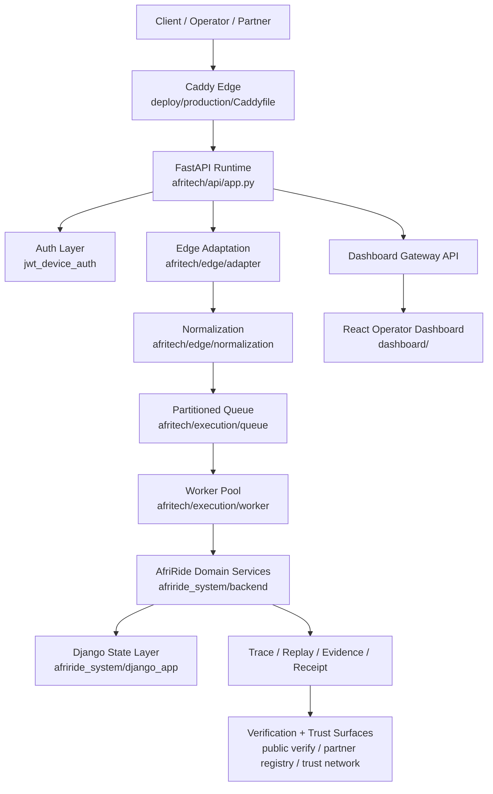

# AfriTech Production Runtime Map

Status: AFRITECH PRODUCTION RUNTIME MAP

Classification: BOUNDED PRODUCTION RUNTIME COORDINATION SURFACE

Purpose: define the actual runtime path used by the current production-style
AfriTech deployment, including container boundaries, request flow, proof flow,
and Django coordination points.

This document is an operational runtime map. It is not proof that every module
in the repository is production-active.

## Runtime Truth

The current production-style entrypoint is:

- `afritech/api/app.py`

The current production-style deployment surface is:

- `deploy/production/docker-compose.production.yml`

The current production-style UI surface is:

- `dashboard/`

The current stateful application layer is:

- `afriride_system/django_app/`

## Runtime Diagram



## Active Production Components

- `afritech/api/app.py`
- `afritech/api/auth/jwt_device_auth.py`
- `afritech/api/ingestion/event_ingestion.py`
- `afritech/api/trace_api.py`
- `afritech/api/system_status.py`
- `afritech/api/public_verification_api.py`
- `afritech/api/partner_registry_api.py`
- `afritech/api/partner_verification_api.py`
- `afritech/api/trust_network_api.py`
- `afritech/api/ops_governance_api.py`
- `afritech/edge/*`
- `afritech/execution/*`
- `afritech/crypto/*`
- `afritech/verify/*`
- `afriride_system/api/*`
- `afriride_system/backend/*`
- `afriride_system/services/system_service.py`
- `afriride_system/django_app/*`
- `dashboard/*`
- `deploy/production/*`

## Active Runtime Sequence

```text
Incoming request/event
-> FastAPI auth gate
-> Edge adaptation
-> Input normalization
-> Partition routing
-> Queue / worker execution
-> AfriRide backend domain logic
-> Django-backed state access where required
-> Trace / replay / evidence / receipt materialization
-> Verification / registry / public response
-> Dashboard and operator observation
```

## Stateful Boundary

FastAPI is the orchestration surface.

Django is the configured state surface.

Replay, evidence, receipt, and verification are admissibility surfaces.

The dashboard is an observation surface.

## Production-Active vs Not Required For Startup

Production-active:

- FastAPI runtime
- Edge normalization
- Execution queue / worker coordination
- Django-backed state access
- Proof / verification routes
- Dashboard build and preview service
- Caddy edge

Not required for production container startup:

- Flutter pilot clients
- Expo mobile clients
- local test harnesses
- most governance tests
- investor package artifacts
- field-only demo scaffolds

## Runtime Risks The Map Makes Explicit

- FastAPI startup must not import Django models before Django settings are ready.
- Django-dependent code must be lazy-loaded or initialized behind a service boundary.
- Public verification routes must remain bounded to `/public/*`.
- The dashboard must not define truth; it observes truth-bearing surfaces.
- Replay and receipt logic must remain deterministic across queue and state transitions.

## Non-Claims

This map does not prove:

- every repo module is production-safe
- all Django surfaces are startup-safe
- all mobile clients are part of the current production runtime
- all governance documents are enforced at runtime
- the platform is globally deployed

## Operational Use

Use this document when:

- debugging container startup
- explaining live request flow
- separating startup-safe modules from Django-bound modules
- preparing partner or operator demos
- reviewing import safety during deployment work
