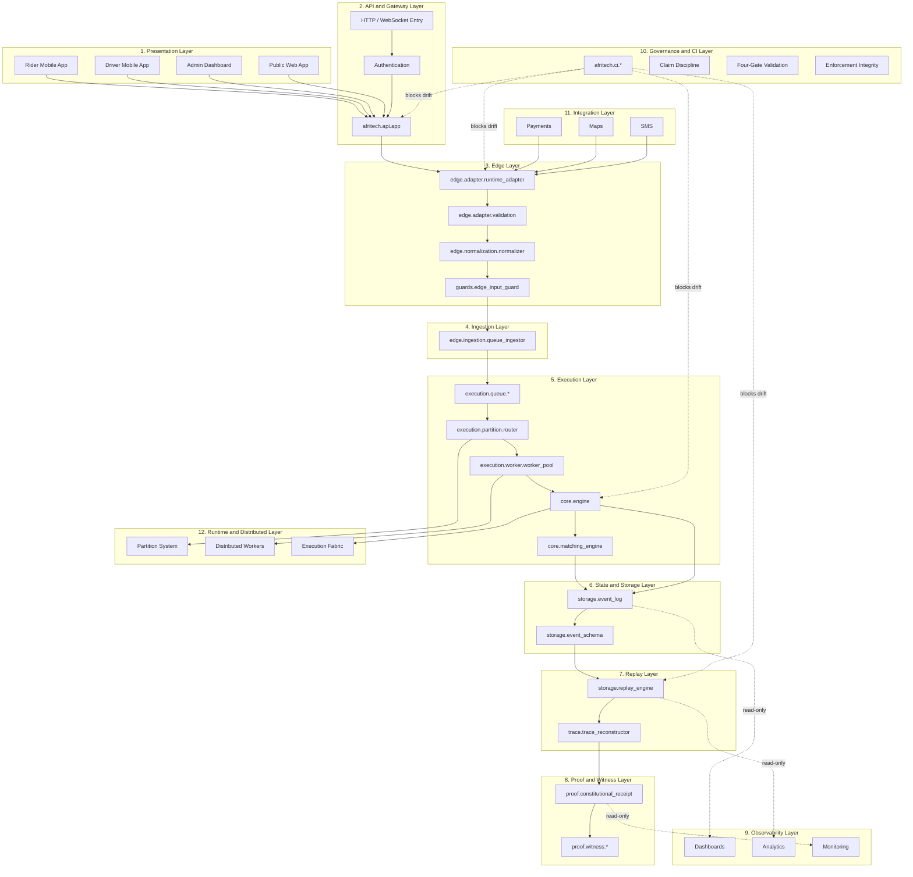
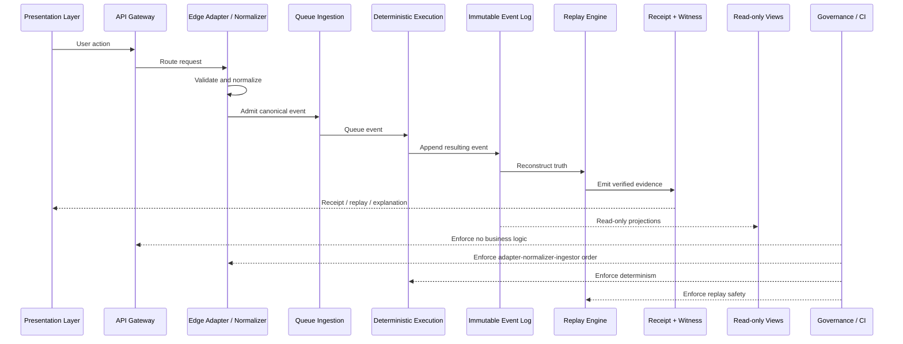
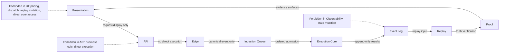

# AfriRide GA eLive Layered Architecture Diagram

This document captures the GA eLive architecture as a layered, enforceable system model aligned with the AfriTech deterministic execution pipeline.

## Artifact Classification

```text
Artifact Type:
EXECUTIVE ARCHITECTURE ARTIFACT

NOT:
Proof Artifact
NOT:
Runtime Authority Surface
```

```text
Diagram explains.
Validators enforce.
Replay proves.
```

## Executive Diagram



## Critical Flow



## Enforcement Boundaries



## Layer Responsibility Matrix

| Layer | Role | Primary Modules | Constraint |
| --- | --- | --- | --- |
| Presentation | User interaction | Rider app, Driver app, Admin Dashboard, Public Web | Display/request only |
| API | Entry point | `afritech.api.app` | No business logic, no direct execution |
| Edge | Input control | `edge.adapter.*`, `edge.normalization.*`, `guards.edge_input_guard` | Adapter to normalization to ingestion only |
| Ingestion | Event admission | `edge.ingestion.queue_ingestor` | Everything becomes an event |
| Execution | Deterministic processing | `execution.queue.*`, `execution.worker.*`, `core.engine`, `core.matching_engine` | Replay-stable output |
| Storage | Immutable state | `storage.event_log`, `storage.event_schema` | Append-only event truth |
| Replay | Truth engine | `storage.replay_engine`, `trace.trace_reconstructor` | Truth equals replay result |
| Proof | Audit evidence | `proof.constitutional_receipt`, `proof.witness.*` | Full traceability |
| Observability | Read-only intelligence | Dashboards, analytics, monitoring | Explain only |
| Governance | Enforcement | `afritech.ci.*` | Blocks drift |
| Integration | External systems | Payments, maps, SMS | Normalize before influence |
| Runtime | Distributed scale | Partitions, distributed workers, execution fabric | Deterministic convergence |

## System Law

```text
Request -> Event -> Deterministic Execution -> Replay -> Proof -> Truth
```

## Enforceable System Law

All admissible system truth MUST satisfy:

```text
1. Request MUST be converted into a canonical event.
2. Event MUST be normalized and hashed deterministically.
3. Execution MUST be performed only through queued worker execution.
4. Execution MUST produce a replayable trace.
5. Replay MUST reconstruct the exact execution deterministically.
6. Proof MUST bind replay output to invariant validation.
7. ONLY replay output constitutes admissible truth.
```

Canonical identity law:

```text
Truth = Replay(Event -> Deterministic Execution)
```

```text
No direct execution from API.
No business logic in presentation surfaces.
No mutation from observability.
No truth without replay.
```

## Forbidden Violations

```text
FORBIDDEN:

- Truth derived from API response.
- Truth derived from UI state.
- Truth derived from logs only.
- Truth derived from receipts without replay validation.
- Any execution bypassing queue ingestion.
- Any non-deterministic execution path.
```

## Frozen Enforcement Boundaries

```text
Boundary 1:
API -> Core
FORBIDDEN

Boundary 2:
Edge -> Core (direct)
FORBIDDEN

Boundary 3:
Execution outside queue
FORBIDDEN

Boundary 4:
Truth outside replay
FORBIDDEN
```

## Final Closure Statement

```text
AfriRide GA eLive architecture is now formally defined as a replay-governed
deterministic execution system where:

- architecture defines structure,
- validators enforce discipline,
- replay defines truth.

The system enforces a strict execution law:

Request -> Event -> Deterministic Execution -> Replay -> Proof -> Truth

All authority remains bounded below replay, preventing upstream layers
from defining or mutating truth.

This constitutes an executive architectural artifact with full CI
enforcement and invariant alignment.

Controlled pilot readiness remains unproven and is intentionally isolated
from architectural completion claims.
```
