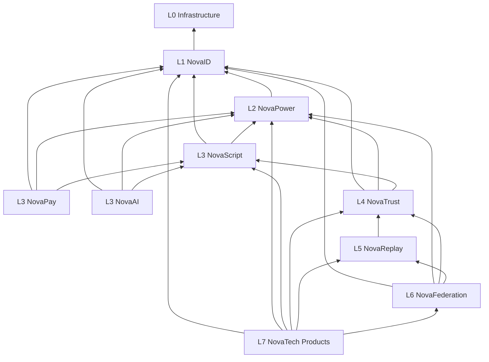

# NovaTech Capability Graph

Generated authority: `afritech/platform_contracts/platform.yaml`

The CI contract validator verifies that all referenced capabilities exist,
dependencies point to the same or lower layers, and the dependency graph is
acyclic.
