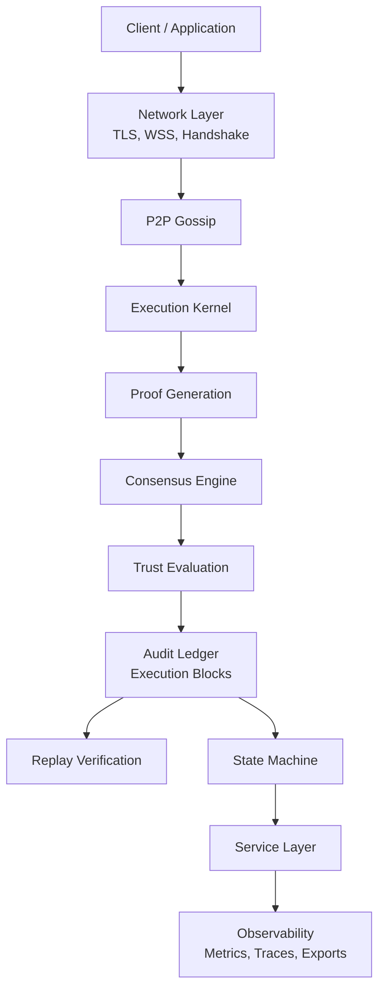
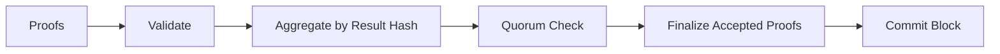
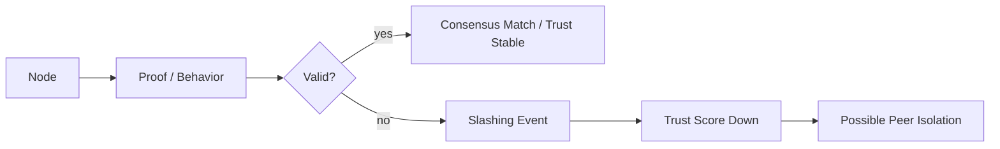
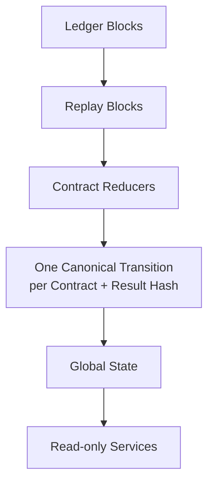
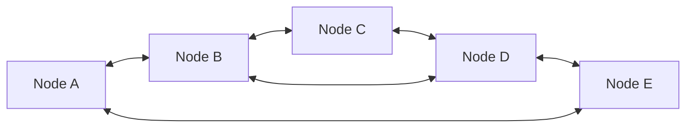
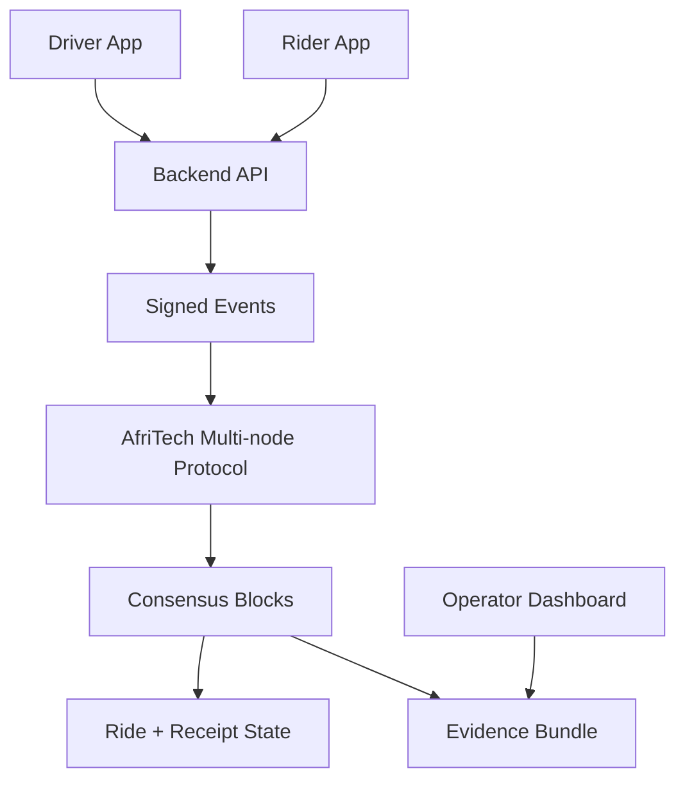

# Diagrams

## Full System Flow



## Consensus Flow



## Trust Flow



## State Projection



## Node Network



## AfriRide Pilot Flow



## Text Fallback

```text
Client -> Network -> P2P -> Execution -> Proof -> Consensus -> Ledger -> State -> Service
Proofs -> Validate -> Aggregate -> Quorum -> Finalize -> Commit Block
Invalid proof -> Slashing -> Trust score down -> Possible isolation
Ledger -> Replay -> Reducers -> Global State
```
