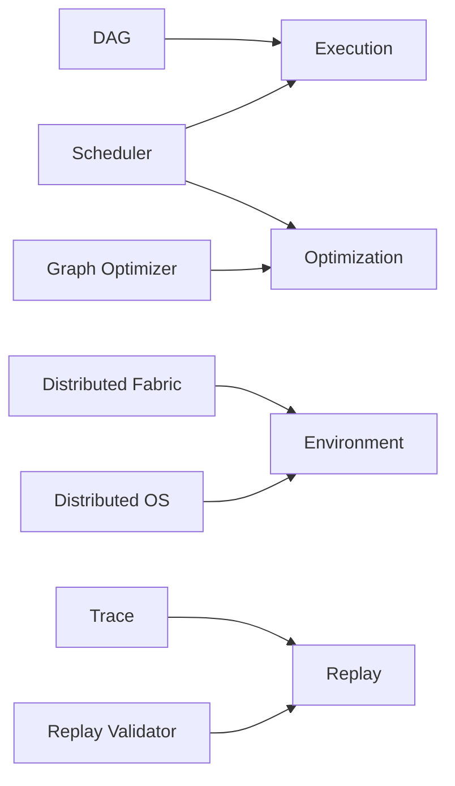
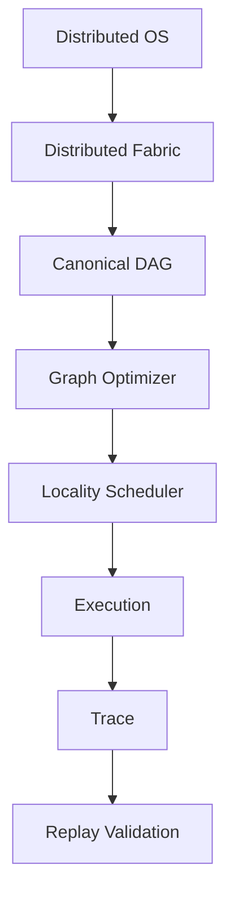
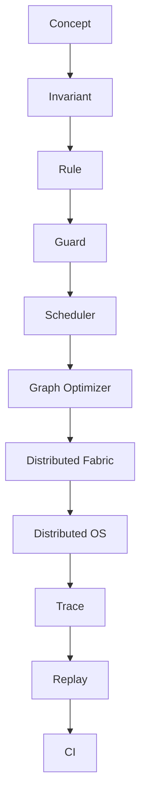
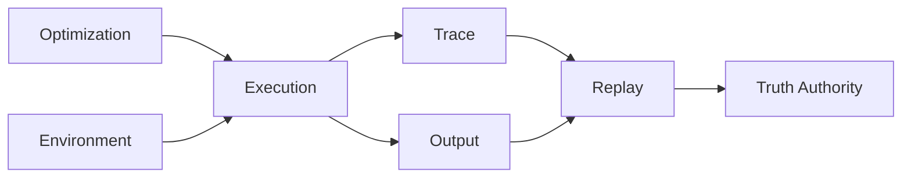

# AfriTech Model v1 Diagrams

## Purpose

These diagrams visualize the canonical model without introducing new concepts.

All diagram elements map to the v1 vocabulary:

- Execution
- Environment
- Optimization
- Replay

## Definition Mapping

## Execution Flow

## Architecture Stack

## Truth Separation

## Constraint

These diagrams are illustrative only.

They must not be used to introduce new definitions, roles, or authority boundaries.
